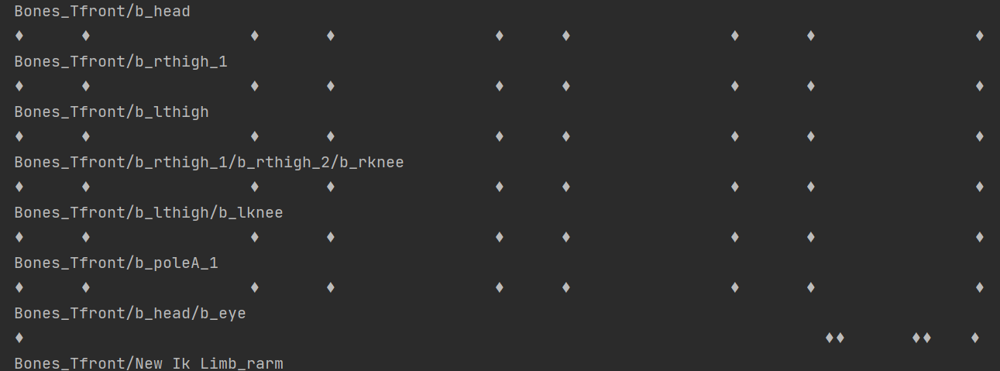
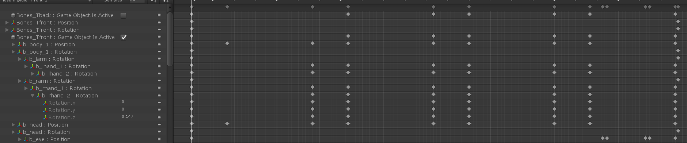

# Anima2D Animation parser
Reads Anima2D's ".anim" files and try to convert it to DragonBones.

For now, it simply prints a timeline to console.

## Proof of Concept
Loading an Anima2D ".anim" file :

The animation in Unity :

