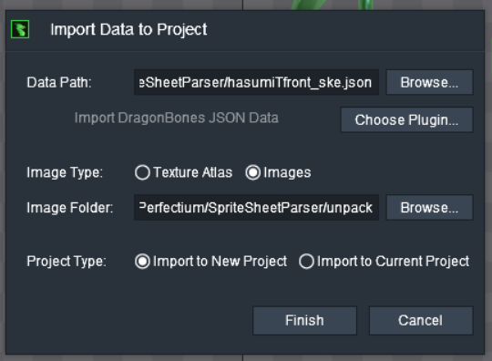

# Anima2D to DragonBones

## Why ?

I had to work on some Anima2D unity project, but it's not maintained anymore and not even supported because of unity new 2D bones engine.

So, we're stuck with 2018 ? No ! Let's break free from Unity (or at least Anima2D) and export our assets to [DragonBones](https://dragonbones.github.io/en/index.html) !

## Why DragonBones not Spine ?
Okay DragonBones is not that active, nor popular but it can export quickly to Spine. Also, it's free and Open Source so we can use and modify our assets without needing paid software.

## Requirements

You'll need `Shapely` (Triangulation algorithm) and `Pillow` (Image crop). 
To get started you should create a venv and install the requirements : `pip install -r requirements.txt`

## Usage

> TODO: Make the helper cli friendly, and not hardcode path in it

You'll need to have a "unpack" folder created, and the unpacked assets
(You can uncomment line `im1.save(filename + ".png", "PNG")` for automatic assets unpacking)

`python parse.py`

Import the generated files in Dragon Bones :

 - Data Path: `_ske.json` file
 - Image Folder: `unpack` folder

